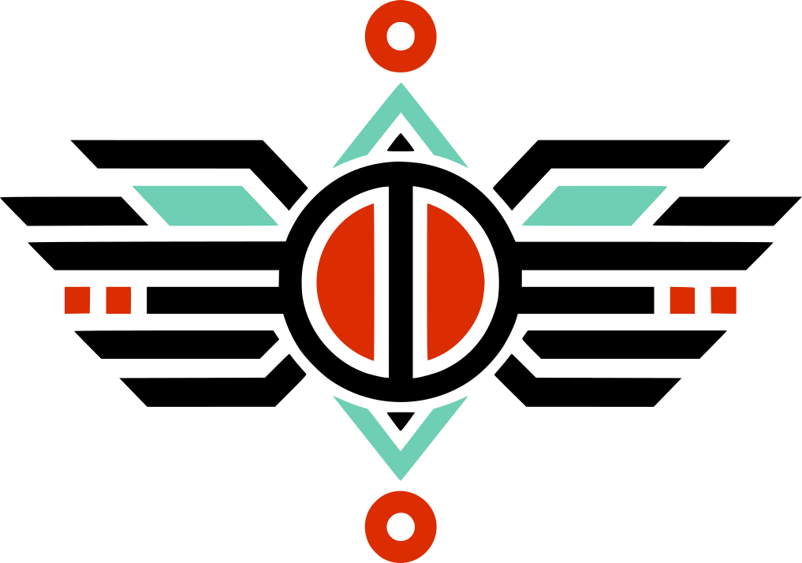

<p align="center">
  
</p>

<h1 align="center">yxy-develop/homebrew-tap</h1>

<p align="center">The Homebrew tap for the Yxy compiler.</p>

<p align="center">
<a href="https://yxy.dev">yxy.dev</a> ·
<a href="https://yxy.dev/docs">Documentation</a> ·
<a href="https://github.com/yxy-develop/yxy">Compiler</a> ·
<a href="https://github.com/orgs/yxy-develop/discussions">Discussions</a>
</p>

## About this tap

The Homebrew tap for **Yxy**, an open source, compiled, general-purpose systems
programming language (<https://yxy.dev>). It works with Homebrew on macOS and on
Linux.

```sh
brew install yxy-develop/tap/yxy
yxy --version
```

The formula builds `yxy` from source, at the tag named in
[`Formula/yxy.rb`](Formula/yxy.rb), with the Rust toolchain as a build-only
dependency. The compiler has no third-party crates. The tag is not repeated in
this sentence on purpose: prose that repeats a version goes stale without
anyone noticing.

While the Yxy repositories are private, installing needs a GitHub account with
access to `yxy-develop/yxy` and an SSH key configured for git; Homebrew fetches
the source with the installing user's own credentials, pinned to the tag and
its commit.

## What works where

| Host | After installing |
|---|---|
| macOS (Apple silicon, Intel) | check, format, inspect, build and run programs; clang comes with the Command Line Tools (`xcode-select --install`) |
| Linux (x86-64, AArch64) | check, format, inspect and emit object files; clang comes from the `llvm` formula. Linking and running executables on Linux is not supported yet |

Support per target is recorded, with its evidence, in
`docs/implementation/TARGETS.md` of the `yxy` repository. Nothing here promises
more than that file.

## Checks before every change

```sh
brew style yxy-develop/tap
brew audit --strict yxy-develop/tap/yxy
brew install --build-from-source yxy-develop/tap/yxy
brew test yxy-develop/tap/yxy
```

They run locally before every push. The GitHub workflow runs the same checks,
started by hand for now, so private runners do not spend minutes on every push.

## Community

A problem with the formula or with installing belongs in this repository's
Issues; a problem with `yxy` itself, in the
[compiler's](https://github.com/yxy-develop/yxy). Questions go to
[Yxy Discussions](https://github.com/orgs/yxy-develop/discussions). The
[contribution guide](https://github.com/yxy-develop/.github/blob/HEAD/CONTRIBUTING.md),
[support policy](https://github.com/yxy-develop/.github/blob/HEAD/SUPPORT.md),
[security policy](https://github.com/yxy-develop/.github/blob/HEAD/SECURITY.md)
and [code of conduct](https://github.com/yxy-develop/.github/blob/HEAD/CODE_OF_CONDUCT.md)
are shared by every Yxy repository. Anything else:
[contact@yxy.dev](mailto:contact@yxy.dev).

## License

BSD 3-Clause, copyright HYZIS - SERVICOS DIGITAIS LTDA - EPP. See
[LICENSE](LICENSE).

## Em português

Tap do Homebrew para a **Yxy**, linguagem de programação open source,
compilada, de sistemas e de propósito geral. Funciona com o Homebrew no macOS e
no Linux: `brew install yxy-develop/tap/yxy`. A fórmula compila o `yxy` do
fonte, na tag indicada em `Formula/yxy.rb`, usando o Rust só na compilação.

Enquanto os repositórios da Yxy forem privados, a instalação exige uma conta
GitHub com acesso a `yxy-develop/yxy` e chave SSH configurada no git. No macOS,
o `yxy` verifica, compila e executa programas. No Linux, por enquanto, verifica
e gera arquivos objeto; ligar e executar no Linux ainda não é suportado.
Dúvidas vão para as
[Discussões da Yxy](https://github.com/orgs/yxy-develop/discussions); contato:
[contact@yxy.dev](mailto:contact@yxy.dev).
